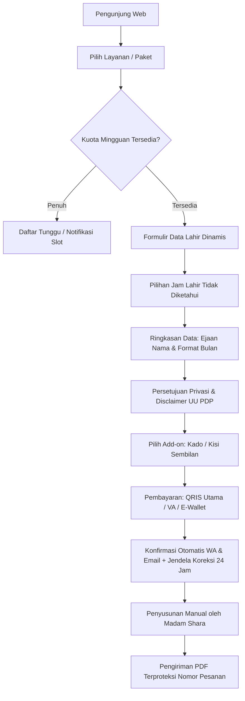

# MASTER PLAN & REQUIREMENTS: LINTANG · STUDIO PETA DIRI
> **Sumber Utama**: *Rancangan Pembuatan Website Lintang (Oct 3, 2026 · @Shara)* & *Rancangan Website Lintang — Versi 2 (Oct 3, 2026 · @Fadhiya Fairy)*.  
> **Status**: Living Specification & Master Implementation Blueprint.

---

## 1. Ringkasan & Filosofi Brand

* **Definisi**: Lintang · Studio Peta Diri adalah toko layanan laporan digital dari data momen kelahiran, bukan sekadar situs profil atau media hiburan.
* **Tugas Utama**: Mengonversi pengunjung media sosial (Instagram & TikTok) menjadi pembeli laporan melalui alur terstruktur:  
  $$\text{Pilih Layanan} \longrightarrow \text{Isi Data Lahir Dinamis} \longrightarrow \text{Bayar (QRIS/VA/E-Wallet)} \longrightarrow \text{Terima Laporan PDF}$$
* **Prinsip Utama ("Peta, Bukan Ramalan")**:
  * Menjelaskan bahwa Lintang adalah cermin dan peta navigasi potensi diri, bukan ramalan masa depan yang deterministik.
  * Menegakkan batasan tiap sistem, privasi data lahir yang ketat (kepatuhan UU No. 27/2022 PDP), dan disclaimer legal di setiap langkah.
* **Sosok di Balik Brand**:
  * **Madam Shara**: Pendiri, penyusun, dan pembaca utama. Seluruh laporan disusun atau diperiksa dengan teliti secara manual ("Nilai Rapi").
  * **Atribut Brand**: Di header/footer tercantum *"oleh Madam Shara"*. Menggunakan sapaan hangat "kamu", santai tapi rapi, seperti kakak yang memahami astrologi dan sistem Timur.

---

## 2. Tiga Tujuan Website & Ukuran Keberhasilan (Metrik)

| Metrik | Rumus | Event GA4 | Fungsi / Insight |
| :--- | :--- | :--- | :--- |
| **Konversi Kalkulator $\to$ Kontak** | $\text{Isian Kontak} \div \text{Pengunjung Kalkulator}$ | `calc_start`, `lead_submit` | Mengukur efektivitas lead magnet gratis |
| **Konversi Kontak $\to$ Pembeli Pertama** | $\text{Pembeli Sekilas Lintang/Kode Diri} \div \text{Kontak Baru}$ | `purchase` + sumber kontak | Mengukur konversi tangga nilai awal |
| **Konversi Checkout** | $\text{Pembayaran Sukses} \div \text{Formulir Checkout Dimulai}$ | `begin_checkout`, `purchase` | Mendeteksi titik friksi formulir data lahir |
| **Titik Batal Checkout** | $\text{Drop-off Rate per Tahap}$ | `checkout_step` | Optimasi langkah input $\to$ ringkasan $\to$ bayar |
| **Naik Kelas (Repeat Order)** | $\text{Pembeli ke-2 (Seri Langit / Lintang Utuh)} \div \text{Total Pembeli}$ | `purchase` + pembeli ulang | Validasi tangga nilai Rp49rb $\to$ Rp199rb+ |
| **Sumber Trafik** | UTM per platform (IG, TikTok, WhatsApp) | Parameter UTM | Menentukan kanal konten dengan ROI tertinggi |

---

## 3. Arsitektur Informasi & Struktur Halaman

Navigasi Utama: **Layanan (Katalog)** · **Kalkulator Gratis** · **Kado Lintang** · **Jurnal** · **Tentang Lintang** (Footer: FAQ, Kontak, Syarat & Ketentuan, Kebijakan Privasi, Disclaimer).

### 3.1 Beranda (Landing Page)
* **Hero Section**: Langit malam dengan visual rasi 8–5–2+9, headline *"Baca polamu, pilih langkahmu."*, subjudul positioning, dan dual CTA (*Coba Kalkulator Gratis* / *Lihat Layanan*).
* **"Bukan ramalan, tapi peta"**: 3 kalimat ringkas paradigma Lintang.
* **Katalog 4 Lini Layanan**: Kartu layanan terstruktur dengan data lahir yang dibutuhkan + badge *"Mulai dari sini"* untuk pintu masuk termurah.
* **Alur Kerja 3 Langkah**: Pilih layanan $\to$ Isi data lahir $\to$ Terima laporan, dilengkapi estimasi waktu kirim dan status *"Slot Minggu Ini"*.
* **Pratinjau Laporan & Bukti Sosial**: Cuplikan halaman laporan (pratinjau buram estetis) + testimoni pembeli terverifikasi.
* **5 Nilai Lintang**: Jujur, Hangat, Membumi, Rapi, Menjaga Privasi.

### 3.2 Katalog & 4 Lini Layanan (17 Layanan/Paket)
1. **Seri Angka** (Data: Nama sesuai akta kelahiran + tanggal lahir):
   * *Kode Diri* (Numerologi Pythagoras 5 Angka Inti: Life Path, Expression, Soul Urge, Birthday, Personality).
   * *Musim Diri* (Siklus Tahun Personal 1–9).
   * *Kartu Lahir* (Major Arcana Tarot Birth Card 0–21).
2. **Seri Langit** (Data: Tanggal, jam, dan kota lahir; Empat Pilar membutuhkan jenis kelamin):
   * *Peta Bintang* (Astrologi Natal Barat & Zodiak).
   * *Empat Pilar Diri* (BaZi / Empat Pilar Nasib Tiongkok).
   * Fitur khusus: Checkbox *"Jam lahir tidak diketahui?"* dengan penjelasan otomatis batasan laporan sebelum bayar.
3. **Seri Relasi** (Data: Dua individu + pernyataan izin orang kedua):
   * *Dua Lintang* (Analisis dinamika kecocokan numerologi & astrologi).
   * *Dua Lintang + Sesi Temu*.
4. **Paket & Pendampingan (Tangga Nilai)**:
   * *Sekilas Lintang* (Pintu masuk terjangkau, Rp49.000).
   * *Lintang Utuh* (Sintesis komprehensif lintas sistem).
   * *Lintang Utuh + Sesi Temu* (Laporan lengkap + konsultasi privat via Zoom).
5. **Add-on Checkout**:
   * *Kisi Sembilan & Jejak Karma* (+Rp49.000 untuk Kode Diri).
   * *Kado Lintang* (+Rp25.000 untuk kemasan hadiah digital/cetak + ucapan personal).

### 3.3 Kalkulator Gratis (Lead Magnet)
* Perhitungan otomatis di browser (client-side) untuk **Life Path Number** dan **Musim Diri**.
* **Aturan Perhitungan**:
  * Angka Master (11, 22, 33) dipertahankan, tidak direduksi ke satu digit.
  * SOP pergantian tahun Musim Diri konsisten (1 Januari / saat ulang tahun).
  * Pengujian ketat untuk tanggal-tanggal batas (1 Januari, 31 Desember, 29 Februari kabisat).
* **Alur Hasil**: Hasil ringkas langsung terlihat tanpa barrier; hasil komprehensif + rekomendasi layanan dikirimkan setelah mengisi kontak (Email/WA) dan mencentang persetujuan privasi.

---

## 4. Panduan Desain Visual, Tone of Voice, & Aksesibilitas

### 4.1 Palet Warna Resmi
| Peran | Hex Code | Pemakaian & Panduan Kontras |
| :--- | :--- | :--- |
| **Biru Malam** | `#1F2A44` | Hero, header, footer, teks judul, teks body kontras tinggi (~12:1 di atas Krem). |
| **Krem Pasir** | `#F4EDE1` | Latar belakang halaman, kartu refleksi, kontras lembut bersahabat. |
| **Terakota** | `#C2673F` | Tombol utama, badge penting, harga, aksen fokus. *(Varian `#A8512C` disiapkan untuk teks putih AA).* |
| **Emas Redup** | `#C9A45C` | Garis rasi, ikon astrologi/numerologi, aksen ornamen (6:1 di atas Biru Malam). |
| **Hijau Sage** | `#8A9A7B` | Rekomendasi *"Langkah minggu ini"*, indikator privasi & status sukses. |

### 4.2 Tipografi & Ikonografi
* **Font Judul**: `Fraunces` / `Cormorant Garamond` (klasik, berbobot, reflektif).
* **Font Isi & UI**: `DM Sans` / `Inter` (bersih, terbaca jelas di layar mobile).
* **Simbol**: Kisi 9 titik Lo Shu, garis rasi tipis minimalis, tekstur kertas alami. *Dilarang keras memakai visual mistis gelap, tengkorak, atau bola kristal.*

### 4.3 Aksesibilitas & UI Rules
* **Area Sentuh Mobile**: Tombol dan form input minimal $44 \times 44\text{ px}$.
* **Mobile-First In-App Browser**: Diuji khusus pada WebView Instagram dan TikTok (termasuk penyimpanan state sementara form agar tidak hilang saat beralih app).
* **Zero Redundancy Dialogs**: 1 tombol close presisi di pojok kanan atas, dukungan tombol `Esc`, dan penutupan via backdrop.

---

## 5. Alur Pemesanan, Checkout, & Operasional

1. **Formulir Data Lahir Dinamis**: Field input menyesuaikan kebutuhan sistem (Seri Angka vs Seri Langit vs Relasi).
2. **Ringkasan Validasi**: Tanggal lahir wajib ditampilkan dengan nama bulan tertulis (contoh: *7 Maret 1996*) guna mencegah kesalahan hari/bulan.
3. **Pembayaran Lokal**: QRIS diprioritaskan (potongan terendah), didukung Virtual Account dan E-Wallet.
4. **Jendela Koreksi 24 Jam**: Pembeli diberikan link koreksi mandiri sebelum laporan mulai diproses.
5. **Watermark & Nomor Pesanan**: PDF laporan mencantumkan nomor pesanan untuk mencegah distribusi tidak sah.

---

## 6. Kepatuhan Hukum, Privasi Data, & Manajemen Risiko

* **UU No. 27/2022 (PDP)**:
  * Centang persetujuan terpisah antara *Pemrosesan Data Lahir* dan *Email/WA Promosi*.
  * Jaminan hak penghapusan data kapan saja atas permintaan pemesan.
  * Batas masa simpan data lahir yang jelas setelah laporan terkirim.
* **Disclaimer Wajib**:  
  > *"Layanan Lintang ditujukan untuk refleksi diri dan hiburan, bukan pengganti nasihat profesional medis, hukum, keuangan, atau psikologis."*
* **Mitigasi Risiko Kapasitas**: Sistem kuota mingguan otomatis mengunci tombol pemesanan saat batas kapasitas tercapai untuk mempertahankan standar kualitas laporan.
